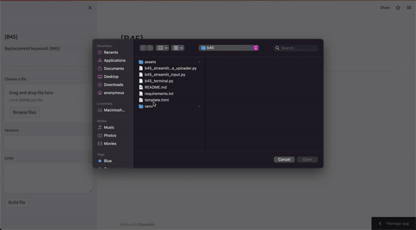

# 🐝 B45

## Application used to duplicate multiple HTML files with difference links, words, etc.

### [https://saintclever-b45-b45-streamlit-file-uploader-01-bzi467.streamlitapp.com/](https://saintclever-b45-b45-streamlit-file-uploader-01-bzi467.streamlitapp.com/)

### Instructions
- Paste in the provided replacement keyword **{B45}** in your html file... ex:
    - `<h1>Hello from {B45}<h1>`
    - `<a href="{B45}">{B45}</a>`  

- Upload your html file  

- Create comma separated version names for each file in the versions input field
    - ex: A, B, C
    - Will produce file - A.html, file - B.html, file - C.html etc  

- Provide comma separated links, or your desired words
    - ex: x, http://streamlit.io, http://stackoverflow.com, http://stackoverflow.com  

- The output
    - file - A.html
    - `<h1>Hello from http://streamlit.io<h1>`
    - `<a href="http://streamlit.io">http://streamlit.io</a>`  

    - file - B.html
    - `<h1>Hello from http://stackoverflow.com<h1>`
    - `<a href="http://stackoverflow.com">http://stackoverflow.com</a>`  
    
    - file - C.html
    - `<h1>Hello from http://stackoverflow.com<h1>`
    - `<a href="http://stackoverflow.com">http://stackoverflow.com</a>`  

### NOTE: The number of links should match the number of file versions